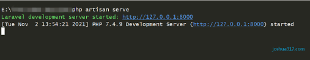

# Financial Hub App

# Used PHP/PHP Extensions For Laravel and etc/Laravel/Alpine.js/Livewire/MySql 

## Functional application for obtaining and selling stocks from stock market,
## using https://finnhub.io/ api.

## This app is only for demonstration purposes only!

---
## Main Pages


---

## Stocks Management


---

## Dashboard


---

## Requirements:

### Registered api key from https://finnhub.io/
### Git
### Code Editor PHPSTORM or any other
### Mysql or any other database for information storing
### PHP
### PHP Extensions For Laravel and etc

---

# How To Set up:

## Execute commands specified in terminal successfully:

### 1. Clone or download with Git to your chosen directory

### 2. In your chosen directory open terminal
#### Terminal should be open in chosen directory root!

### 3. Open chosen directory with your chosen editor

### 4. Rename .env.example file from your chosen directory root to .env in same directory

### 5. Next fill the renamed .env file from your core directory with your credentials:
#### DB_HOST=your_mysql_ip_address
#### DB_DATABASE=your_databases_name
#### DB_USERNAME=your_mysql_database_username
#### DB_PASSWORD=your_mysql_database_password if is set if not leave empty
#### API_KEY=api_key_from_https://finnhub.io/

### 6. Run composer to install required packages

```
composer install
```

#### if a command failed because of requirements try this command instead

```
composer install --ignore-platform-reqs
```

### 7. Generate app key

```
php artisan key:generate
```

### 8. Migrate database migrations to fill your database with all the necessary tables and columns:

```
php artisan migrate
```


### 9. Run the App command:

````
php artisan serv
````

### 10. Open your browser and navigate to http://127.0.0.1:8000:
#### or if in your terminal is written different address navigate to it
#### or for shortcut press ctrl and left mouse button in your terminal on your generated address should open browser with served page



### 12. Register in register page to use app


## Enjoy!

---


###  Default images are located in public/images:
#### icon.png for favicon
#### logo.jpg for logo images
#### no_image.jpg for alternative image if no image exists


