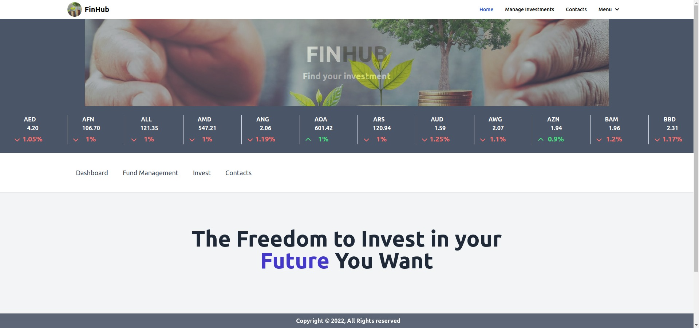
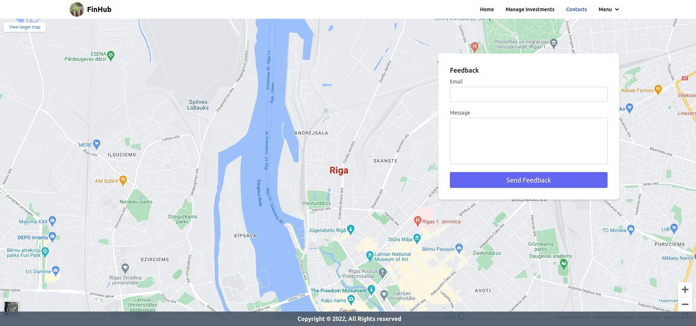
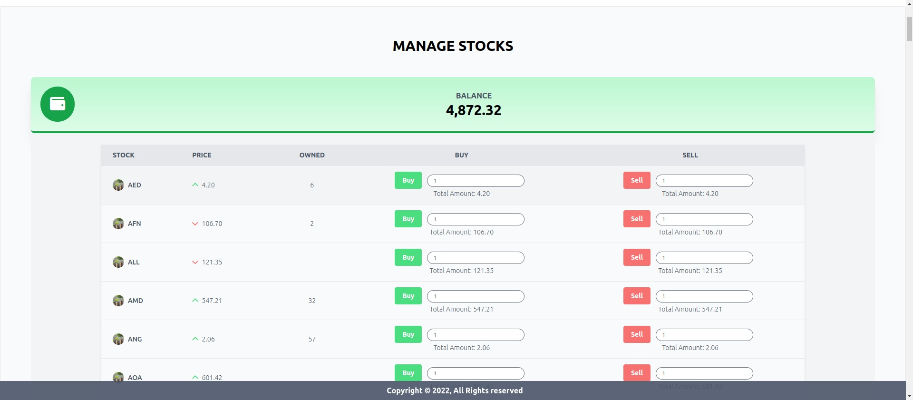
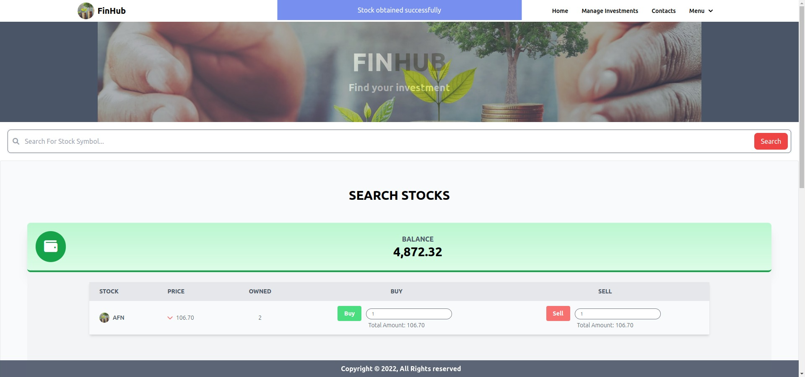
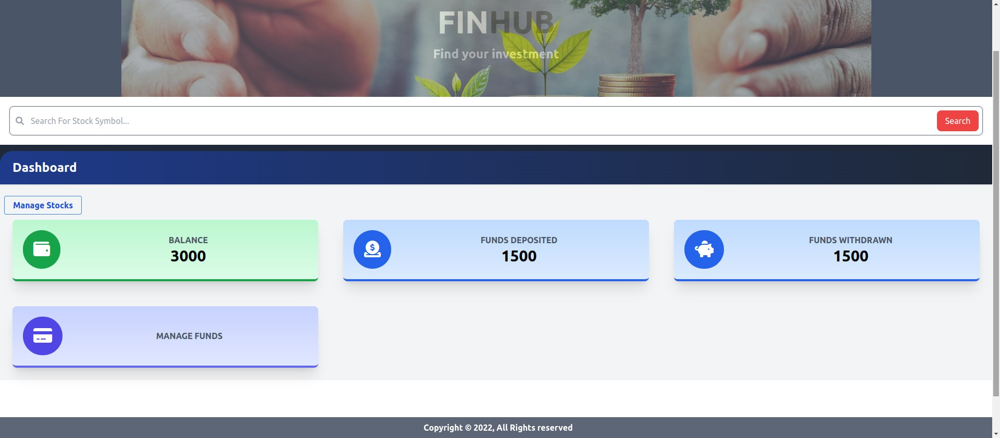
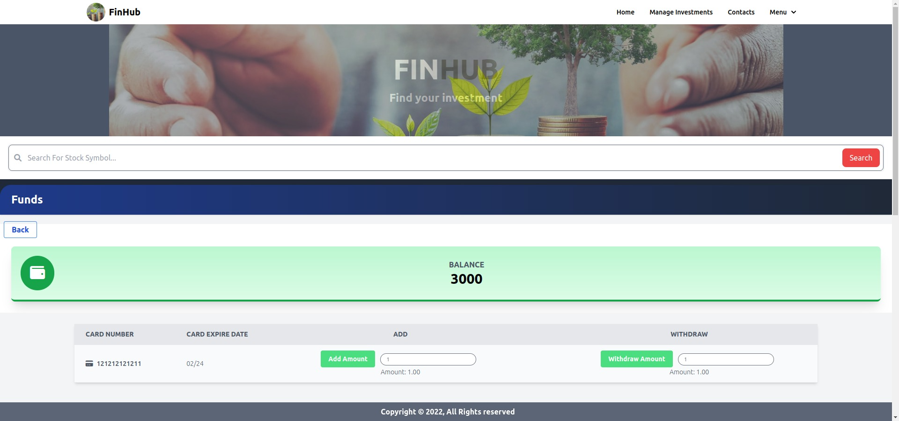
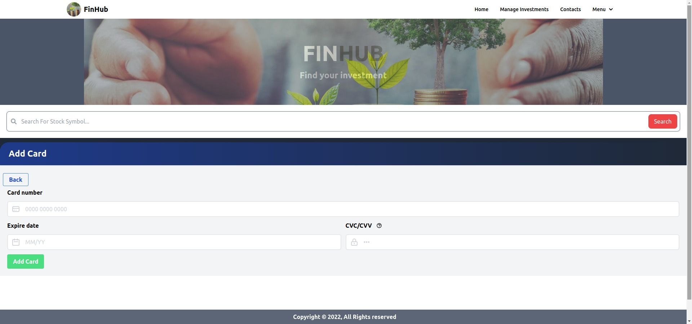

# PHP/Laravel/Alpine.js/Livewire/MySql created finance hub app. 

## Fully functional application for obtaining and selling stocks from stock market,
## using https://finnhub.io/ api.

## This app is only for demonstration purposes only!

## Main Pages

---





## Stocks Management

---




---

## Dashboard





---


# How To Set up:


## Requirements: 

### Mysql or any other database for information storing.
### PHP installed on your machine
### Registered api key from https://finnhub.io/

### 1. Clone or download to your chosen directory

### 2. Open with your chosen editor.

### 3. First you need  to rename .env.example file to .env.

### 4. Next fill the .env file in core folder with your:
#### MySql(or any other db, then change driver in .env from mysql to sqlite etc..)
#### Api key from https://finnhub.io/

### 5. Set in .env file ip address/databases name, which will be used/username/password if exists.

## Execute commands specified in terminal successfully:

### 6. Migrate database migrations to fill your database with all the necessary tables and columns:

```
php artisan migrate
```

###  7. Default images are located in public/images:
#### icon.png for tab icon
#### logo.jpg for logo images
#### no_image.jpg for alternative image if no image exists


### 9. Run the App command:

````
php artisan serve
````

### 10. Register in register page to login and use app

## Enjoy!

---
